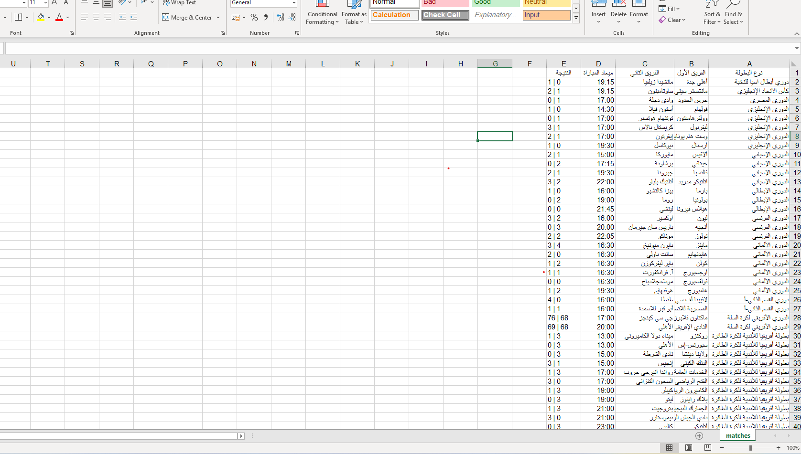

# Yallakora Match Scraper

## About The Project:
This project is a Python-based web scraper designed to extract daily match schedules and results (Football, Basketball, Volleyball, etc.) from the "Yallakora" website based on a user-defined date. The extracted data is then cleaned, formatted, and automatically saved into a structured `CSV` file, ready for data analysis.

## Features:
- **Anti-Blocking:Uses `Headers` to simulate a real browser request, successfully bypassing server blocks.
- **Clean & Safe Code:Implements robust Error Handling (`try/except`) to prevent crashes in case of sudden website structure changes or connection drops.
- **Smart Data Formatting:Resolves the common Excel auto-formatting bug (where match scores turn into dates) by using text separators.
- **Dynamic Input:Allows users to input any past or future date to fetch its specific matches instantly.

## Built With:
- `Python 3`
- `BeautifulSoup4` (HTML Parsing)
- `Requests` (HTTP Requests)
- `CSV` & `Datetime`

## Screenshot

---

##  نبذة باللغة العربية (Arabic Description)
هذا السكريبت عبارة عن أداة مبرمجة بلغة بايثون لاستخراج جداول المباريات اليومية من موقع "يلا كورة" وتصديرها تلقائياً إلى ملف `CSV` جاهز للتحليل. 

يتميز هذا المشروع بـ:
- تخطي حظر الخوادم باستخدام تقنية الـ `Headers`.
- كود نظيف يتعامل بذكاء مع الأخطاء (Error Handling) لضمان عدم توقف البرنامج.
- معالجة البيانات النصية لتظهر بشكل جدول منسق وسليم 100% عند فتحها في برنامج `Excel` (تجنب مشكلة تحول النتائج إلى تواريخ).
